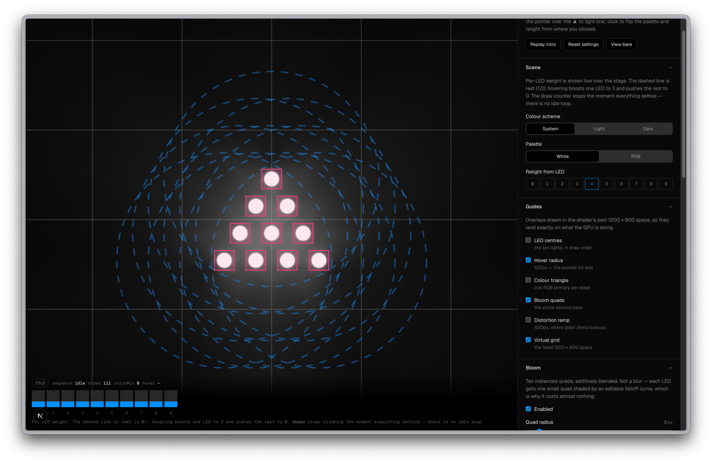

# vercel.crafter.run

A study of the vercel.com hero animation, rebuilt from scratch in raw WebGL2,
with a playground for taking it apart.

For research and learning purposes only. Not affiliated with Vercel; the shader
source and the baked light atlas (`public/hero/agent-light-atlas-rgb.webp`) are
their work.



```bash
bun install
bun dev
```

- `/` - the animation, with a star count in the top corner
- `/playground` - live shader controls, geometry overlays, the choreography
  curves, and the baked light atlas

## What it covers

- How ten lights get rendered from three baked ones
- Why the whole effect is a function of just two animated numbers
- How it draws nothing at all when nothing is moving

Notes on each: [the component](components/hero-animation/README.md) and
[the playground](components/playground/README.md).

The star count comes from the GitHub API at build time and refreshes hourly;
set `GITHUB_TOKEN` if you ever hit the unauthenticated rate limit. Page views
are counted with [Vercel Web Analytics](https://vercel.com/docs/analytics).
